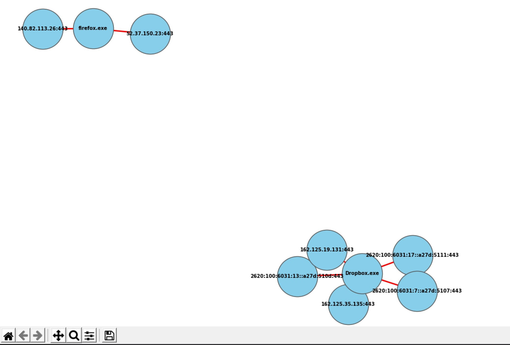

# NstatLogger

NstatLogger.py or netstat logger is a multi platform (Windows/ Linux) python3 script that can be used as DFIR tool which will log all uniq communications from a host to a log file (csv & log) in current directory, with the following info:

  - Proto
  - Local address:port
  - Remote address:port
  - Status
  - PID
  - Program name
  - Time started
  - Command line
  
## NstatResolver
NstatResolver.py can later be used against the NstatLogger.csv file to perform reverse IP lookup (using system dns) and get more info using one of the following:
  - Retrieve dns history of an IP through [Threat Crowd API](https://github.com/AlienVault-OTX/ApiV2) and [VirusTotal API](https://developers.virustotal.com/v3.0/reference) which is recommended as it is passively collect data (without connecting to the remote addresses).
  - Retrieve SSL alternative names through the use of python modules (pyopenssl, requests) which will connect to each remote IP and get the list (it is more accurate, but its not a good practice when doing an investigation) use it if the passive approch doesn't get enough info, and use it behind proxy/vpn. 

## NstatAnalyzer
NstatAnalyzer.py can be used against NstatLogger.csv to perform a relational graph connecting process names with the remote addresses


### Dependencies:
The tool depends on the awsome [psutil](https://github.com/giampaolo/psutil) python module , [requests](https://pypi.org/project/requests/) module, pandas, networkx and matplotlib.

### Installation:
Install the dependencies:
```sh
$ git clone https://github.com/id4rksid3/NstatLogger.git
$ cd NstatLogger
$ python3 -m pip install -r requirements.txt
```
or download the stand alone Windows exe files from [release](https://github.com/iD4rksid3/NstatLogger/releases).

or compile it yourself using pyinstaller:
```
$ pyinstaller -i .\rsrc\file.ico -F NstatLogger.py
$ pyinstaller -i .\rsrc\file2.ico --hidden-import=requests  -F NstatResolver.py
```
### Usage:
The tool can run without administrator/root priviliage, but it will not be able to collect all the informtion
```sh
D:\NstatLogger.exe -h
#or
$ python3 NstatLogger.py -h
    _   __     __        __  __
   / | / /____/ /_____ _/ /_/ /   ____  ____ _____ ____  _____
  /  |/ / ___/ __/ __ `/ __/ /   / __ \/ __ `/ __ `/ _ \/ ___/
 / /|  (__  ) /_/ /_/ / /_/ /___/ /_/ / /_/ / /_/ /  __/ /
/_/ |_/____/\__/\__,_/\__/_____/\____/\__, /\__, /\___/_/
                                     /____//____/ v1.0    ©Mayed.alm
usage: NstatLogger [-h] [-r RESOLVE] [-t TIMER] [-i INTERVAL]
[+] Log netstat like TCP/IP and UDP connections from host
optional arguments:
  -h, --help            show this help message and exit
  -t TIMER, --timer TIMER
                        Set timer in seconds of when to stop capturing,
                        default will run until user termination (ctrl+c)
  -i INTERVAL, --interval INTERVAL
                        Set capturing interval in seconds, default is 3
[+] Example: NstatLogger -i 2 -t 3600 (will run NstatLogger for one hour, with
2 seconds interval/refresh)
```
Example:
```
$ python3 NstatLogger.py -t 2000 -i 5 # will run the tool for 2000 seconds with a 5 second interval/refresh
# a NstatLogger-xxx.csv file will be writen to current directory
$ python3 NstatResolver.py NstatLogger-xxx.csv # Performe reverse IP lookup and dns history on the output
```
:exclamation: **Note: Output from -r (resolve) can get messy if dns history or ssl alternative names is huge!, use a tool like notepad++ or mcedit to view the file**

### Use case:
Packet capture can get huge and looking for suspecious communication can get really tedious among all these legit packets, NetFlow traffic can be usefull but again as with packet capture we have no clue which process made that request which what this tool will try to solve, and of course this tool is no replacement for both of these great technologies, it's just a good quick way to start investigation.

### Output sample:
```
Started: Mon Dec 23 12:17:08

Proto Local address         Remote address       Status          PID        Program name         Time started             Command line
tcp   192.168.0.125:53077   184.51.10.38:80      ESTABLISHED     2128       WinStore.App.exe     '09:01:55'               ['C:\\Program Files\\WindowsApps\\MicAppXc75w...xecvgdjhdkgsdza.mca']
tcp   192.168.0.125:53068   93.184.220.29:80     CLOSE_WAIT      2128       WinStore.App.exe     '09:01:55'               ['C:\\ProgramFiles\\WindowsApps\\Microsoft.WindowsStore_11912.1001.1.0_x64__8wekyb3d8bbwe\\WinStore.App.exe', '-ServerName:App.AppXc75wvwned5vhz4xyxxecvgdjhdkgsdza.mca']
tcp   192.168.0.125:55518   162.254.197.180:443  ESTABLISHED     9248       Steam.exe            '09:01:39'               ['C:\\Program Files (x86)\\Steam\\Steam.exe', '-silent']
Ended: Mon Dec 23 12:38:42
```
#### Contributions are welcome.
